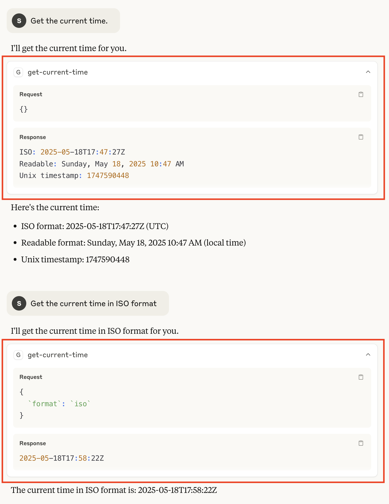

# `mcp-this`

> An MCP Server that dynamically exposes CLI/bash commands as tools through YAML configuration files.

`mcp-this` is an MCP server that dynamically exposes CLI/bash commands as tools for MCP Clients (e.g. Claude Desktop), based on definitions in YAML or JSON configuration files. Rather than requiring you to write code, you simply define the commands, their parameters, and execution details in configuration files, and the server makes them available as tools that clients can use.

- **Dynamically create MCP tools** from YAML configuration files
- **Define command-line tools** with parameters and execution details
- **Default configuration** with common utility tools ready to use
- **JSON configuration support** for programmatic use

---

For example, the following snippet shows a yaml file that defines three tools:

- `get-directory-tree` (via `tree` command)
- `find-files` (via `find` command)
- `web-scraper` (via `lynx` command)

```yaml
tools:
  get-directory-tree:
    description: Generate a directory tree
    execution:
      command: >-
        tree '<<directory>>'
        -a --gitignore
        -I ".git|.claude|.env|.venv|env|node_modules|__pycache__|.DS_Store|*.pyc<<custom_excludes>>"
        <<format_args>>
    parameters:
      directory:
        description: Directory to generate tree for.
        required: true
      custom_excludes:
        description: Additional patterns to exclude (begin with | e.g., "|build|dist").
        required: false
      format_args:
        description: Additional formatting arguments (e.g., "-L 3 -C --dirsfirst")
        required: false

  find-files:
    description: Locate files by name, pattern, type, size, date, or other criteria
    execution:
      command: find '<<directory>>' -type f <<arguments>> | sort
    parameters:
      directory:
        description: Directory to search in (quotes are handled automatically in the command)
        required: true
      arguments:
        description: Additional find arguments (e.g., "-name *.py -mtime -7 -not -path */venv/*")
        required: false

  web-scraper:
    description: Fetch a webpage and convert it to clean, readable text using lynx      
    execution:
      command: lynx -dump -nomargins -hiddenlinks=ignore <<dump_options>> '<<url>>'
    parameters:
      url:
        description: URL of the webpage to fetch and convert to text
        required: true
      dump_options:
        description: Additional lynx options (e.g., -width=100, -nolist, -source)
        required: false
```

If the file above was saved to `/path/to/your/custom_tools.yaml`, the corresponding MCP server config file (e.g. for Claude Desktop) would look like:

```json
{
  "mcpServers": {
    "mcp-this-custom": {
      "command": "uvx",
      "args": [
        "mcp-this",
        "--config-path", "/path/to/your/custom_tools.yaml"
      ]
    }
  }
}
```

---

## Quick Start

### `uvx`

The simplest way to use the server is via `uvx`. This command lets you run Python tools without installing them globally. It creates a temporary environment just for that tool, runs it, and then cleans up.

> **Note:** Examples below require installation of `uvx` - instructions can be found at [https://docs.astral.sh/uv/](https://docs.astral.sh/uv/).

### Configuration

The MCP Server can be configured to use:
- **Built-in presets** via the `--preset` command (e.g., `--preset default` or `--preset editing`)
- **Custom tools** defined in a YAML file via the `--config-path` command
- **Custom tools** via a JSON string with the `--config-value` command
- **Default tools** from the built-in `default` preset if no configuration is provided

#### Built-in Presets

| Preset | Description | Usage |
|--------|-------------|-------|
| **default** | Safe, read-only tools for analysis and information gathering | Used automatically when no config specified, or explicitly with `--preset default` |
| **editing** | File and directory editing tools for development workflows | `--preset editing` |
| **github** | GitHub integration tools for PR analysis and repository operations | `--preset github` |

## Claude Desktop Integration

### Setting Up MCP-This with Claude Desktop

1. Start Claude Desktop
2. Navigate to `Settings -> Developer` and click "Edit Config"
3. Open `claude_desktop_config.json` in your editor of choice

### Using Built-in Presets

#### Default Tools (Safe, Read-Only)

When no configuration is specified, the server uses safe, read-only tools for analysis:

```json
{
  "mcpServers": {
    "mcp-this-default": {
      "command": "uvx",
      "args": ["mcp-this"]
    }
  }
}
```

> **Note:** Some default tools require additional dependencies. See [Default Tool Dependencies](#default-tool-dependencies) for installation instructions.

#### Editing Tools (File Operations) - ALPHA

> **Alpha Notice:** The editing tools are in an early development stage and may contain bugs or unexpected behavior. Use with caution in production environments.

For development workflows requiring file editing capabilities:

```json
{
  "mcpServers": {
    "mcp-this-editing": {
      "command": "uvx",
      "args": ["mcp-this", "--preset", "editing"]
    }
  }
}
```

#### GitHub Tools

For GitHub integration and PR analysis:

```json
{
  "mcpServers": {
    "mcp-this-github": {
      "command": "uvx",
      "args": ["mcp-this", "--preset", "github"]
    }
  }
}
```

> **Note:** Requires GitHub CLI (gh) to be installed and authenticated.
> Install with: `brew install gh` (macOS) or see https://cli.github.com/
> Authenticate with: `gh auth login`

#### Multiple Presets Together

You can run multiple presets simultaneously for maximum functionality:

```json
{
  "mcpServers": {
    "mcp-this-default": {
      "command": "uvx",
      "args": ["mcp-this"]
    },
    "mcp-this-editing": {
      "command": "uvx",
      "args": ["mcp-this", "--preset", "editing"]
    },
    "mcp-this-github": {
      "command": "uvx",
      "args": ["mcp-this", "--preset", "github"]
    }
  }
}
```

> **Note:** The default preset requires additional dependencies for some tools. See [Default Tool Dependencies](#default-tool-dependencies) for installation instructions.

**Setup Notes:** 

A few of the default tools use commands that may not be installed on your machine (e.g. `tree`, `lynx`). See [Default Tool Dependencies](#default-tool-dependencies) for installation instructions.

**Restart Claude Desktop** after updating your configuration.

You should now see your configured MCP server(s):


**View and enable tools** by clicking on the server:


> **Troubleshooting:** If you see a `spawn uvx: ENOENT` or similar message:
> - Make sure you have `uvx` installed
> - Ensure `uvx` is in your `PATH` or use the full path (e.g., `/Users/<username>/.local/bin/uvx`)
> - Check that dependencies for tools are installed (see [Default Tool Dependencies](#default-tool-dependencies))

### Using Prompts in Claude Desktop

Some presets (like GitHub) include specialized prompts for development workflows. To use prompts in Claude Desktop:

1. **Click the `+` icon** in the message input box
2. **Select "Add from [mcp server]"** (e.g., "Add from mcp-this-github")
3. **Choose the prompt** you want to use:
   - **create-pr-description**: Generate comprehensive PR descriptions from code changes
   - **code-review**: Perform thorough code reviews focusing on best practices and security
4. **Provide the required input**: You can enter:
   - Code snippets or diffs
   - GitHub PR URLs (the prompt will fetch the information automatically)
   - Local directory paths for analysis
   - File paths to specific files

**Example workflow:**
- Use `get-local-git-changes-info` tool to analyze your local Git changes
- Use `create-pr-description` prompt with the output to generate a PR description
- Use `code-review` prompt to review code before submitting

### Creating Custom Tools with YAML

**Step 1:** Create a file called `custom_tools.yaml` with these contents:

```yaml
tools:
  get-current-time:
    description: |
      Display the current date and time in various formats.
      
      If no format is specified, all formats will be displayed.

      Examples:
      - get_current_time(format="iso")
      - get_current_time(format="readable")
      - get_current_time(format="unix")
    execution:
      command: >-
        if [ "<<format>>" = "iso" ]; then 
          date -u +"%Y-%m-%dT%H:%M:%SZ"; 
        elif [ "<<format>>" = "readable" ]; then 
          date "+%A, %B %d, %Y %I:%M %p"; 
        elif [ "<<format>>" = "unix" ]; then 
          date +%s; 
        else 
          echo "ISO: $(date -u +"%Y-%m-%dT%H:%M:%SZ")"; 
          echo "Readable: $(date "+%A, %B %d, %Y %I:%M %p")"; 
          echo "Unix timestamp: $(date +%s)"; 
        fi
    parameters:
      format:
        description: "Time format to display (iso, readable, unix, or leave empty for all formats)"
        required: false
```

This yaml defines a single tool that will print out the current date/time in different formats. For example, `format=iso` will give `2025-05-18T17:17:39Z`.

**Step 2:** Configure Claude Desktop to run both default and custom tools:

```json
{
  "mcpServers": {
    "mcp-this-default": {
      "command": "uvx",
      "args": ["mcp-this"]
    },
    "mcp-this-custom": {
      "command": "uvx",
      "args": [
        "mcp-this",
        "--config-path", "/path/to/your/custom_tools.yaml"
      ]
    }
  }
}
```

**Step 3:** Restart Claude Desktop to see both servers:


**Step 4:** Enable and use your custom tool:


When using the tool in Claude Desktop, you will see something like:



#### NOTE

- Avoid using `command: |` when defining commands in YAML. This format preserves line breaks, which can interfere with how commands are processed in tools.py. Instead, use `command: >-` to ensure proper formatting of multi-line commands.

### Configuring with a JSON String

You can also pass a JSON string containing tool definitions directly:

```json
{
  "mcpServers": {
    "mcp-this-default": {
      "command": "uvx",
      "args": ["mcp-this"]
    },
    "mcp-this-custom": {
      "command": "uvx",
      "args": [
        "mcp-this",
        "--config-value",
        "{\"tools\":{\"current-time\":{\"description\":\"Display the current date and time in various formats.\\n\\nExamples:\\n- current_time(format=\\\"iso\\\")  # ISO format (2023-05-18T14:30:45)\\n- current_time(format=\\\"readable\\\")  # Human readable (Thursday, May 18, 2023 2:30 PM)\\n- current_time(format=\\\"unix\\\")  # Unix timestamp (1684421445)\\n\\nIf no format is specified, all formats will be displayed.\",\"execution\":{\"command\":\"if [ \\\"<<format>>\\\" = \\\"iso\\\" ]; then date -u +\\\"%Y-%m-%dT%H:%M:%SZ\\\"; elif [ \\\"<<format>>\\\" = \\\"readable\\\" ]; then date \\\"+%A, %B %d, %Y %I:%M %p\\\"; elif [ \\\"<<format>>\\\" = \\\"unix\\\" ]; then date +%s; else echo \\\"ISO: $(date -u +\\\"%Y-%m-%dT%H:%M:%SZ\\\")\\\"; echo \\\"Readable: $(date \\\"+%A, %B %d, %Y %I:%M %p\\\")\\\"; echo \\\"Unix timestamp: $(date +%s)\\\"; fi\"},\"parameters\":{\"format\":{\"description\":\"Time format to display (iso, readable, unix, or leave empty for all formats)\",\"required\":false}}}}}"
      ]
    }
  }
}
```

---

## Configuration Format

Configuration can be provided as either a YAML file or a JSON string. The format supports defining both tools and prompts.

### Basic Structure

The example below shows the definition of a single tool called `tool-name`. The command that this tool will execute is `command-to-execute <<parameter_name>>`. `<<parameter_name>>` will be replaced with the corresponding value passed by the MCP Client (e.g. `session.call_tool('tool-name',{'parameter_name': 'This is the param value that will be passed to the tool'})`).

For optional parameters (`required: false`), if the MCP client does not the parameter, the `<<parameter_name>>` will be removed before executing the command.

```yaml
tools:
  tool-name:
    description: "Description of what the tool does"
    execution:
      command: "command-to-execute <<parameter_name>>"
    parameters:
      parameter_name:
        description: "Description of the parameter"
        required: true
```

### Tool Configuration

Each tool requires the following configuration:

| Component | Description |
|-----------|-------------|
| **description** | Human-readable description of the tool with examples |
| **execution** | Command template with parameter placeholders (`<<parameter>>`) |
| **parameters** | Definitions for each parameter the tool accepts |

Parameters are specified in the form `<<parameter_name>>` in the command template and will be replaced with the actual parameter values when executed.

### Prompt Configuration

In addition to tools, you can define prompts in your configuration. Prompts are templates that can be used to generate structured requests or instructions for AI models.

```yaml
tools:
  # ... tool definitions ...

prompts:
  prompt-name:
    description: "Description of what the prompt does"
    template: |
      Your prompt template here with {{argument_name}} placeholders.
      {{#if optional_argument}}Conditional content for {{optional_argument}}.{{/if}}
    arguments:
      argument_name:
        description: "Description of the argument"
        required: true
      optional_argument:
        description: "Optional argument description"
        required: false
```

Each prompt requires the following configuration:

| Component | Description |
|-----------|-------------|
| **description** | Human-readable description of the prompt's purpose |
| **template** | Template string with Handlebars-style placeholders (`{{argument}}`) |
| **arguments** | Definitions for each argument the prompt accepts |

Prompt templates use Handlebars-style syntax:
- `{{argument_name}}` for simple variable substitution
- `{{#if argument_name}}...{{/if}}` for conditional content
- Arguments are defined similarly to tool parameters but use `{{}}` instead of `<<>>`

**Example from `examples/prompts_example.yaml`:**

```yaml
prompts:
  simple-greeting:
    description: Generate a personalized greeting message
    template: |
      Generate a warm, friendly greeting for {{name}}.
      {{#if occasion}}The greeting is for {{occasion}}.{{/if}}
      {{#if tone}}Use a {{tone}} tone.{{/if}}
      
      Make it personal and engaging.
    arguments:
      name:
        description: Name of the person to greet
        required: true
      occasion:
        description: Special occasion (optional)
        required: false
      tone:
        description: Tone of the greeting (e.g., formal, casual, enthusiastic)
        required: false
```

---

## Built-in Tools

### Default Preset Tools (Safe, Read-Only)

The default preset provides safe, read-only tools for analysis and information gathering:

| Tool | Description |
|------|-------------|
| **get-directory-tree** | Generate a directory tree with standard exclusions and gitignore support |
| **find-files** | Locate files by name, pattern, type, size, date, or other criteria |
| **find-text-patterns** | Search for text patterns in files with context and filtering |
| **extract-file-text** | Display file contents with options for line numbers or filtering |
| **extract-code-info** | Analyze code files to extract functions, classes, imports, and TODOs |
| **web-scraper** | Fetch webpages and convert to clean, readable text |

> **Note:** Some tools require additional dependencies. See [Default Tool Dependencies](#default-tool-dependencies) for installation instructions.

### Editing Preset Tools (File Operations)

The editing preset provides powerful file and directory manipulation tools:

| Tool | Description |
|------|-------------|
| **create-file** | Create new files with specified content |
| **edit-file** | Modify files with precise control (insert, replace, delete) |
| **create-directory** | Create new directories or directory structures |

### GitHub Preset Tools (GitHub Integration)

The github preset provides GitHub integration and analysis tools:

| Tool | Description |
|------|-------------|
| **get-github-pull-request-info** | Get comprehensive PR information including overview, files changed, and complete diff |
| **get-local-git-changes-info** | Get comprehensive information about local Git changes including status, diffs, and untracked files |

### GitHub Preset Prompts

The github preset also includes specialized prompts for development workflows:

| Prompt | Description |
|--------|-------------|
| **create-pr-description** | Generate comprehensive pull request descriptions from code changes, diffs, or PR URLs |
| **code-review** | Perform thorough code reviews focusing on best practices, security, and maintainability |

> **Note:** Requires GitHub CLI (gh) to be installed and authenticated.
> Install with: `brew install gh` (macOS) or see https://cli.github.com/
> Authenticate with: `gh auth login`

### Default Tool Dependencies

For the default tools to work correctly, install the following dependencies:

**macOS:**
```bash
brew install tree  # Required for get-directory-tree
brew install lynx  # Required for web-scraper
```

---

## Usage Examples

### Python Client API

```python
from mcp import ClientSession, StdioServerParameters
from mcp.client.stdio import stdio_client

# Start server with default configuration
server_params = StdioServerParameters(
    command='python',
    args=['-m', 'mcp_this'],
)
# Note: Some default tools require additional dependencies (tree, lynx)
# See Default Tool Dependencies section for installation instructions

async with stdio_client(server_params) as (read, write):
    async with ClientSession(read, write) as session:
        await session.initialize()
        
        # List available tools
        tools = await session.list_tools()
        for tool in tools.tools:
            print(f"- {tool.name}")
        
        # Call a tool
        dir_tree_result = await session.call_tool(
            'get-directory-tree',
            {'directory': '/path/to/project'},
        )
        print(dir_tree_result.content[0].text)
```

### Defining Custom Tools in Python

```python
import json
from mcp import ClientSession, StdioServerParameters
from mcp.client.stdio import stdio_client

# Define custom tools
config = {
    'tools': {
        'extract-html-text': {
            'description': "Fetch a webpage and extract pure text, removing HTML tags",
            'execution': {
                'command': "curl -s <<url>> | sed '/<style/,/<\\/style>/d; /<script/,/<\\/script>/d' | sed 's/<[^>]*>//g'",
            },
            'parameters': {
                'url': {
                    'description': "URL of the webpage to fetch",
                    'required': True,
                },
            },
        },
    },
}

# Start server with custom configuration
server_params = StdioServerParameters(
    command='python',
    args=['-m', 'mcp_this', '--config-value', json.dumps(config)],
)

async with stdio_client(server_params) as (read, write):
    async with ClientSession(read, write) as session:
        await session.initialize()
        
        # Call custom tool
        result = await session.call_tool(
            'extract-html-text',
            {'url': 'https://example.com'},
        )
        print(result.content[0].text)
```

## Configuration Methods

You can provide configuration in several ways:

| Method | Example |
|--------|---------|
| **Built-in Preset** | `--preset editing`, `--preset github`, `--preset default` |
| **Config File Path** | `--config-path /path/to/config.yaml` (YAML file) |
| **Config Value String** | `--config-value '{"tools": {...}}'` (JSON string) |
| **Environment Variable** | `MCP_THIS_CONFIG_PATH=/path/to/config.yaml` |
| **Default Config** | If no configuration is provided, the default preset is used |

## Development

### Setup Development Environment

```bash
# Clone the repository
git clone https://github.com/your-username/mcp-this.git
cd mcp-this

# Install dependencies
uv sync
```

### Running Tests

```bash
# Run all tests, including linting
make tests

# Run only unit tests
make unittests

# Run only linting checks
make linting

# View test coverage
make open_coverage
```

### Building and Publishing the Package

```bash
# Build the package
make package-build

# Publish the package (requires UV_PUBLISH_TOKEN)
make package-publish
```

### Adding Dependencies

```bash
# Add a regular dependency
uv add <package>

# Add a development dependency
uv add <package> --group dev
```

## License

[Apache License 2.0](LICENSE)

# Security Considerations

⚠️ **Important Security Notice**: This MCP server executes shell commands based on configuration files and user input. Please read and understand these security implications before deploying.

## Overview

`mcp-this` is designed to expose CLI tools through MCP by executing shell commands. While this provides powerful functionality, it also introduces security considerations that must be carefully managed, especially in multi-user or production environments.

## Key Security Risks

### 1. **Command Injection**
- **Risk**: The server executes shell commands constructed from user input and configuration templates
- **Impact**: Malicious users could potentially execute arbitrary system commands
- **Mitigation**: 
  - Only use trusted configuration files
  - Validate and sanitize all user inputs
  - Run the server with minimal privileges
  - Consider using containerization or sandboxing

### 2. **File System Access**
- **Risk**: Tools can read, write, and modify files based on provided parameters
- **Impact**: Unauthorized access to sensitive files or system modification
- **Mitigation**:
  - Run with restricted user permissions
  - Use chroot jails or containers
  - Carefully review tool configurations for dangerous operations
  - Monitor file system access

### 3. **Resource Consumption**
- **Risk**: Commands may consume excessive CPU, memory, or disk resources
- **Impact**: System performance degradation or denial of service
- **Mitigation**:
  - Implement resource limits (ulimit, cgroups)
  - Monitor command execution
  - Set appropriate timeouts
